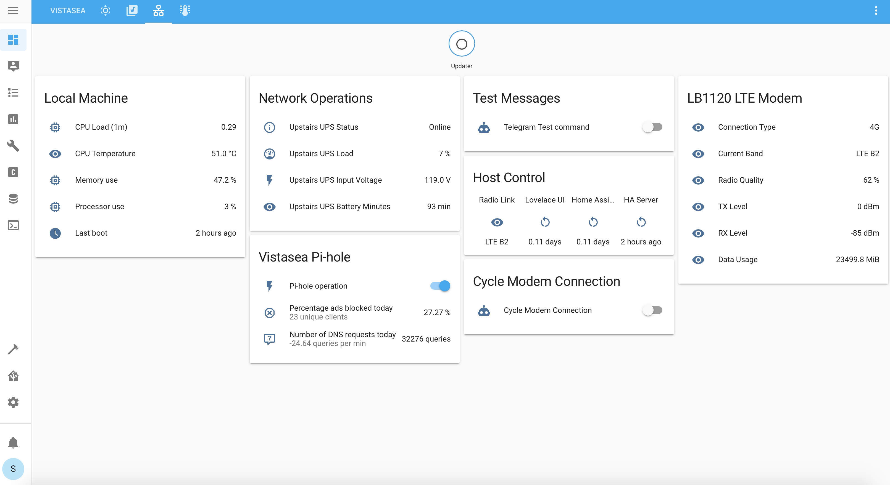

## Configuration for Home Assistant at Vistasea Cabin.

This is Home assistant on a Raspberry Pi 3B+, with a directly connected [BME680 sensor](https://learn.adafruit.com/adafruit-bme680-humidity-temperature-barometic-pressure-voc-gas/overview).

Integrations include
- Netgear LTE modem - our connection to the internet
- nut UPS
- pi-hole (from remote host, not the add-on)
- Unifi Controller
- Unifi Video
- Venstar Thermostat
- Liftmaster MyQ Garage Door Control
- [Weewx](https://github.com/weewx/weewx) Weather software powered by a Davis Vantage Pro2
- Two satellite Pi Zero W which use the [monitor script](https://github.com/andrewjfreyer/monitor) to track blutetooth devices

Home/Main Page:

Net Ops Page:

